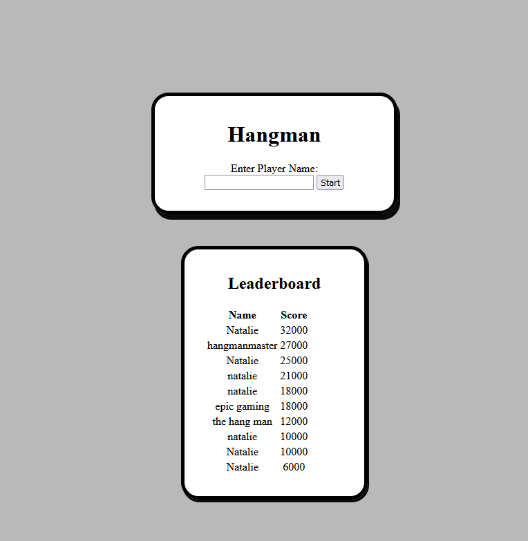
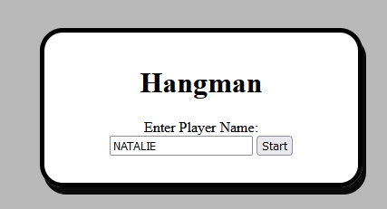
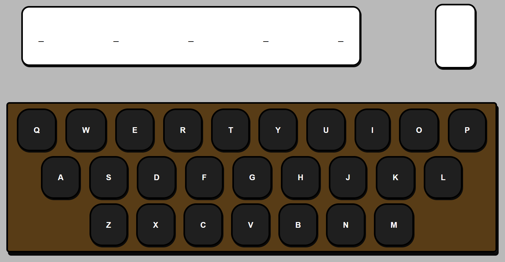
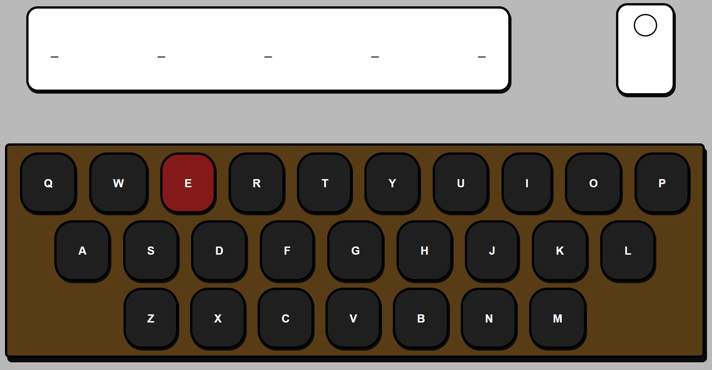
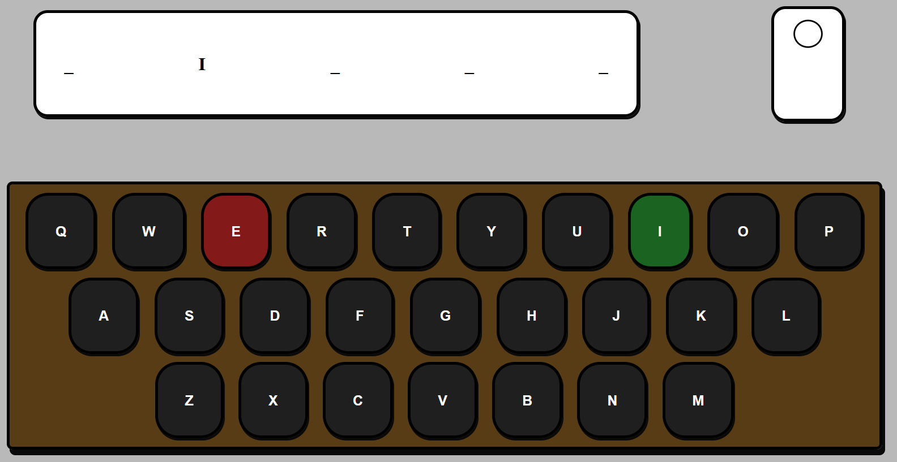
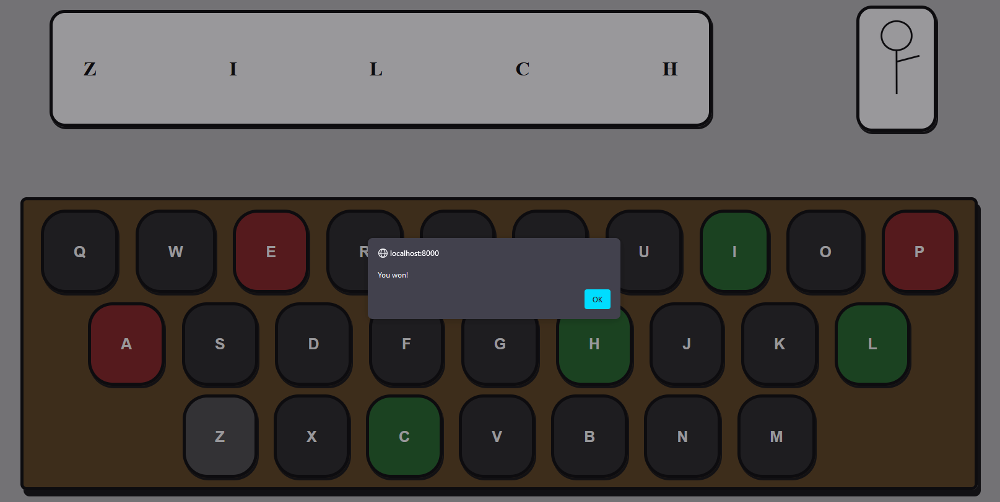
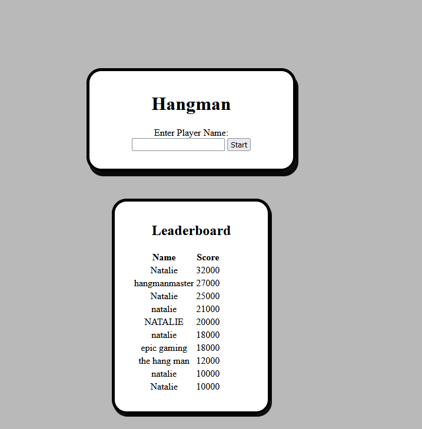

Students: Natalie Colman (300177579) and  Iyanuloluwa Aketepe (Student number)
This is our hangman game, coded in PHP, HTML, JS and CSS.
When you launch the game, you'll see something like this.

At the top of the page is the title, as well as the start screen. You'll need to enter a username before you can play.

Once you're in the game, it'll look like this.
The underlines in the top box indicate your progress on the word. In this case, we can tell the word has five letters. The smaller white box on its right will hold the hanged man upon incorrect letter guesses.
When you're ready to guess, click on any letter on the keyboard. For demonstrative purposes, I'll pick E.
Unfortunately, E was an incorrect guess. But that's okay! We still have more guesses. For my next guess, I'll do I.
A correct guess! "I" was the second letter of the word.
Let's keep guessing until we either win or lose.
If you win with a high enough score, your score will be added to the leaderboard.