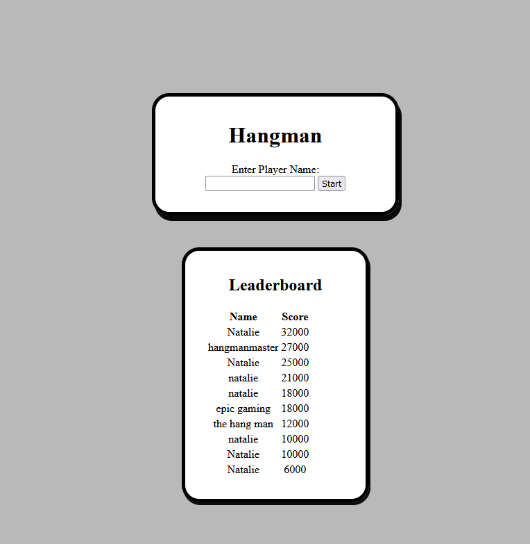
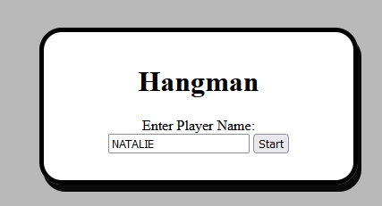
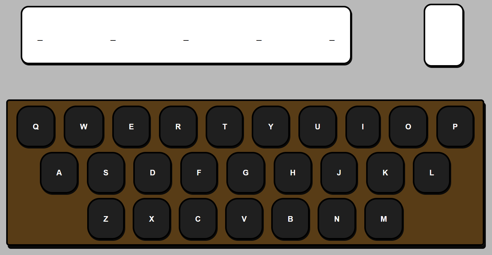
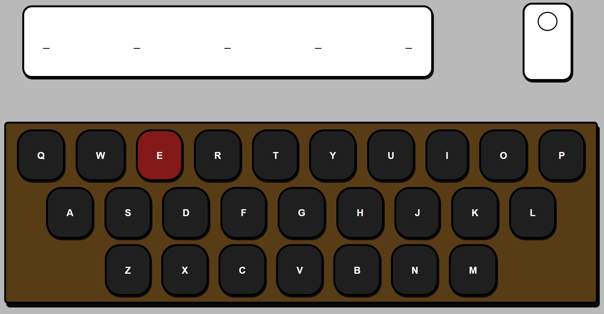
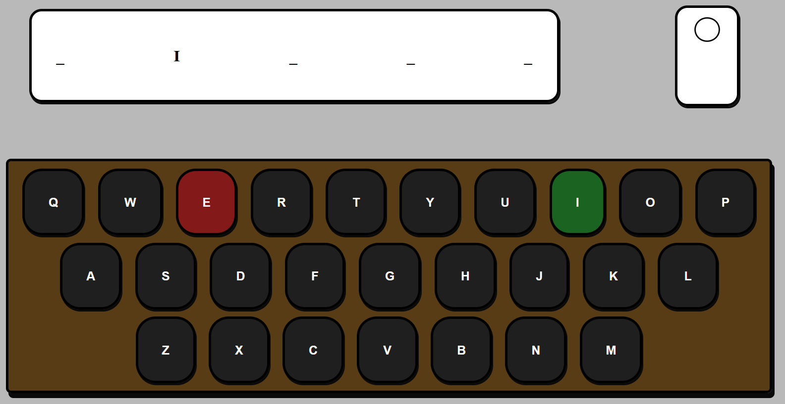
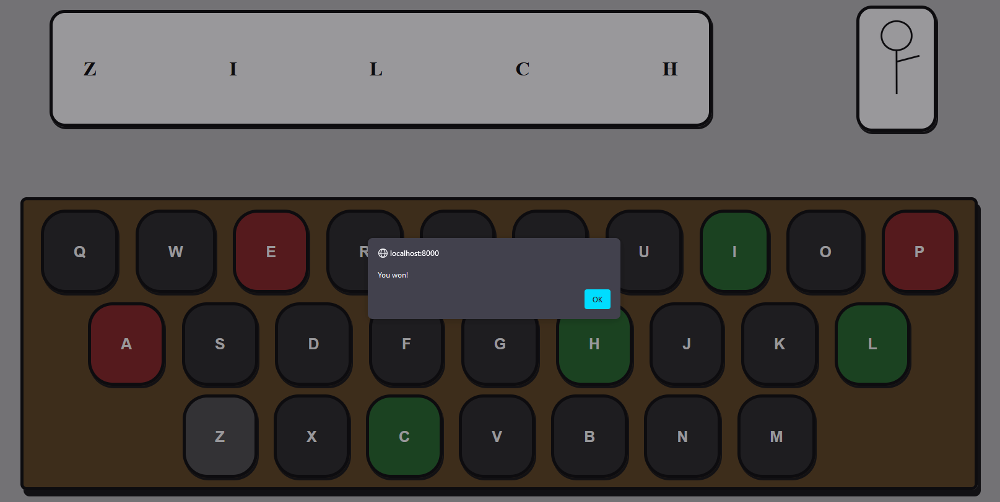
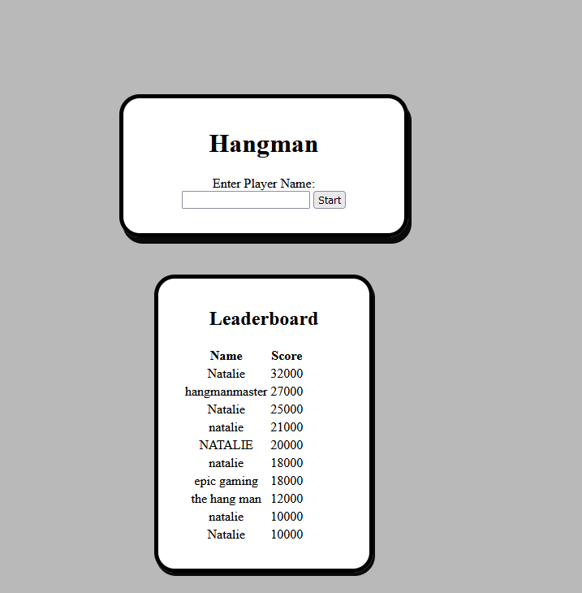

Students: Natalie Colman (300177579) and  Iyanuloluwa Aketepe (300170701)

### Developing the app
This is our hangman game, coded in PHP, HTML, JS and CSS, as well as SQL usage for the database. In order to get started, first we had to install PHP and Postgres.

Inside Postgres' PGAdmin, we created a Leaderboard Schema. Inside that, we created a Leaderboard Table, which holds both the player's name and score. The table holds the ten top-scoring entries.

Additionally, we added the php.ini file to the php folder.

### Playing the game as a user
When you launch the game, you'll see something like this.

At the top of the page is the title, as well as the start screen. You'll need to enter a username before you can play.

Once you're in the game, it'll look like this.

The underlines in the top box indicate your progress on the word. In this case, we can tell the word has five letters. The smaller white box on its right will hold the hanged man upon incorrect letter guesses.
When you're ready to guess, click on any letter on the keyboard. For demonstrative purposes, I'll pick E.

Unfortunately, E was an incorrect guess. But that's okay! We still have more guesses. For my next guess, I'll do I.

A correct guess! "I" was the second letter of the word.
Let's keep guessing until we either win or lose.

If you win with a high enough score, your score will be added to the leaderboard.

### Admin Login:

[Administrator’s start on the same page as user index.php](Assets/image.png)

[Administrator will type their credentials into the “Admin Login” section.](Assets/image.png)

A GET request will be sent to verify the administrator's credentials to the server via hangman-api.php. [The end result for correct credentials will be a redirect based on a url sent by the server.](Assets/image.png)

[This section allows administrators to delete users on the server.](Assets/image.png)

[It also allows administrators to return to the home page, either to play the game themselves or to review the changes to the leaderboard end users will see.](Assets/image.png)
